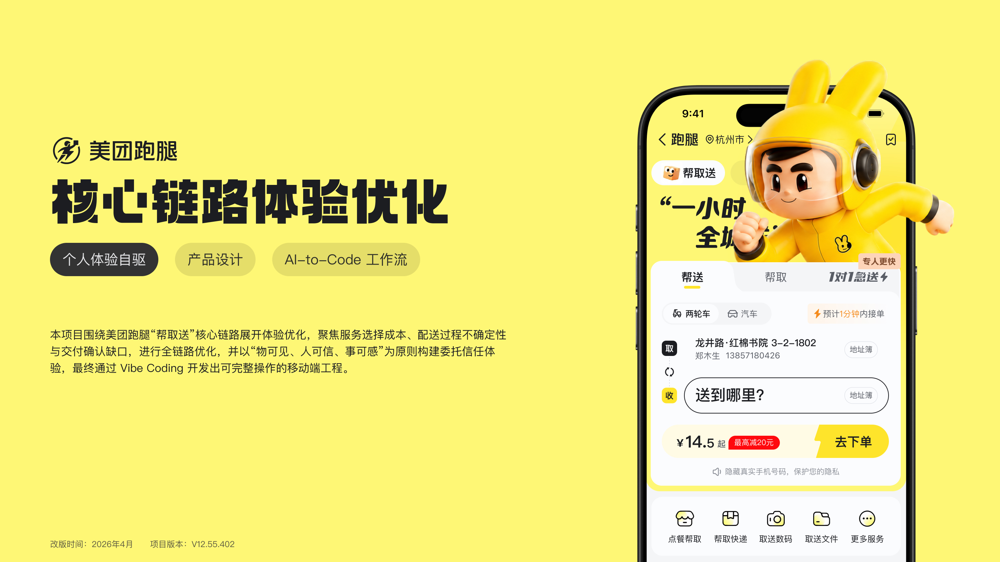

<div align="center">



**Visible items · Trusted couriers · Tangible progress**

<br />

<a href="../README.md">简体中文</a> | <a href="./README.en.md"><strong>English</strong></a>

<br />


<br />

<a href="https://mtpaotui.pages.dev/"></a>

</div>

## Project Overview

This is a self-initiated redesign prototype focused on the core pickup-and-delivery journey of Meituan Errand. It addresses the uncertainty people experience when entrusting important items to an unfamiliar courier: what is being delivered, who is handling it, how far the delivery has progressed, and how successful handoff can be verified.

The design connects service selection, address entry, item details, order confirmation, delivery tracking, and completion feedback into one continuous, transparent, and verifiable experience.

| Project attribute | Details |
| --- | --- |
| Format | Self-initiated UX/UI redesign and high-fidelity interactive prototype |
| Experience scope | Core ordering and tracking journeys for Send, Pick Up, and 1-to-1 Express services |
| Work covered | Product and interaction definition, design system, visual implementation, frontend prototype, and rule testing |
| Prototype status | Runs on mock data and supports the complete core journey without real transaction services |

## Design Context

This self-initiated project focuses on three experience questions:

- **Is the choice clear?** People should quickly understand the differences between services and vehicle options, as well as what information they need to provide next.
- **Does the handoff feel safe?** Important or fragile items need clearer size assessment, delivery recommendations, insurance benefits, and pickup or delivery proof.
- **Is progress tangible?** After an order is submitted, courier identity, delivery stage, ETA, distance, and handoff result should remain visible.

The goal is not to add more features. It is to make each step easier to understand and confirm through continuity of information and timely feedback.

## Design Goals

| Principle | Design response |
| --- | --- |
| **Visible items** | Build a complete item record with category, weight and dimensions, notes, insurance, and pickup or delivery proof. |
| **Trusted couriers** | Present courier identity, rating, satisfaction, and professional tags so the person performing the service feels specific and credible. |
| **Tangible progress** | Continuously communicate delivery status through stages, maps, ETA, remaining distance, and a handoff code. |

## Core Journey

```text
Select a service on the home screen
→ Enter pickup and delivery addresses
→ Complete item details
→ Compare delivery options and confirm the price
→ Submit the order
→ Review delivery progress and proof
→ Confirm successful handoff
```

Addresses, item details, delivery options, and order status share the same order draft. When people return to edit an earlier step, their existing information is preserved and the confirmation screen reflects the latest result.

## Key Improvements

### 1. Easier-to-understand service selection

The home screen brings Send, Pick Up, and 1-to-1 Express together. Switching service updates address roles, capacity information, and the visual theme while keeping the primary journey entry stable.

### 2. Continuous address roles and data

Pickup and delivery use the same form structure, while titles, labels, map markers, and save actions keep the current role explicit. Swapping addresses updates complete address objects and map presentation rather than replacing display text alone.

### 3. Item details that support delivery decisions

The item screen combines category, weight, dimensions, notes, and insurance into one draft. Size and fragility can trigger a car-delivery or insurance recommendation while leaving the final decision with the user.

### 4. Delivery comparison at confirmation

Standard, car, and 1-to-1 Express delivery are presented side by side through price, timing, and service benefits. People can return to edit an address or item and then continue from confirmation without restarting the journey.

### 5. Trust through verifiable delivery information

The tracking screen advances through accepting, pickup, delivery, arrival, and completion within one route. Courier details, map targets, ETA, proof, and the handoff code keep order progress traceable.

## Try the Prototype

Open the [interactive prototype](https://mtpaotui.pages.dev/) to explore the journey.

- **Desktop:** use the device showcase to view the mobile experience and switch between device sizes.
- **Mobile:** open the link directly to use the responsive narrow-screen interface.
- **Suggested path:** choose Send → complete both addresses → select Flowers and enter item details → compare delivery options → submit the order → review tracking and completion.
- **Data note:** addresses, prices, couriers, delivery timing, and proof are demonstration data. No real order or payment is created.

> [!NOTE]
> Some secondary actions consistently show an “Unavailable in this prototype” message so the demonstration can remain focused on the core ordering and tracking journey.

## Technical Implementation

| Layer | Choice |
| --- | --- |
| UI and routing | React 19, React Router |
| Language | TypeScript in strict mode |
| Build tool | Vite |
| Cross-page state | Zustand |
| Styling | Tailwind CSS 4, CSS Custom Properties |
| Data boundary | Repository interfaces with mock implementations |
| Quality checks | TypeScript, ESLint, Stylelint, Vitest, production build |

The prototype separates page composition, shared components, order state, domain models, and data repositories. Delivery stages advance through a single Repository timeline, while pages consume the same snapshot instead of creating conflicting local timelines.

## Run Locally

Requirements: Node.js 20+ and pnpm 10.17.1.

```bash
pnpm install
pnpm dev
```

Run the complete quality gate:

```bash
pnpm check
```

This command runs TypeScript type checking, ESLint, Stylelint, Vitest, and a production build in sequence.

## Project Documentation

- [Product specification](../specs/product.md): positioning, core journey, page rules, and acceptance criteria
- [Design system specification](../specs/design.md): design principles, visual tokens, component contracts, and responsive behavior
- [Engineering and AI development guide](../specs/tech.md): technology, architecture boundaries, quality gates, and collaboration conventions

## Disclaimer

This is a self-initiated, non-commercial design study and interactive prototype. It is not affiliated with, endorsed by, authorized by, or connected to Meituan. Brand names, marks, and related visual assets appear solely for experience analysis, design education, and portfolio presentation.

The prototype does not provide real delivery services and does not process real orders, payments, or personal information. Unless otherwise required by law, no open-source license is currently granted for this repository.
